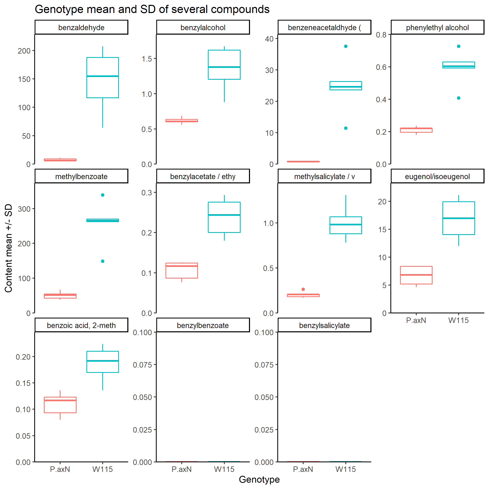

# PTR-MS analysis template

R script and instructions to analyse the output of a PTR-MS analysis. The script is intended for interactive use (eg in Rstudio), not for automated running via the command line.

It is tailored to scent compounds in Petunia, but can be adapted to other quadrupole settings by providing a different mass setting file.
The output files of the PTR-MS Control software are in a proprietary format and I haven't found a way to import those directly in R. I therefore export the data from the PTR-MS Control software at the end of each analysis, using the function "export to clipboard" and pasting in a text file. Note that the default protocol in our lab includes the visualisation of the measured compounds in "concentration" mode (set in the PTR-MS control software). Therefore the results will be mean concentration in ppb.

## How to use this template

You can click on the green button "Code" at the top of this page and download the folder as a .zip (or clone the repo, if you are a git-pro ;) ). You can use the files in the folder as templates and format your files accordingly. You can then remove all the rawdata template files and add yours. Then go to Rstudio, open the [ptr-ms_analysis_template.R](ptr-ms_analysis_template.R) file and go interactively through the script. The script is commented so you should be able to understand what it does and adjust it to your needs, if you have to.

## Rationale of the analysis

The script will connect the sample name (plant or individual ID, not containing the replicate ID) to each cycle of the PTR-MS analysis. It then produces some plots to check stability of the analysis through the cycles, and finally calculates a mean per plant.

More in detail, it calculates mean and standard deviation (SD) of the last five cycles per each sample measured. It then displays a plot of the oxygen mean and SD in each sample measured. This is intended as a plot to check that levels of oxygen were stable below 0.30. If not, we had a problem (tissue stuck to the probe or so). Then we can select one scent compound and produce a similar plot showing mean and SD of the last five cycles, to make sure all analyses were stable. It then offers the opportunity to remove some samples, if their SD is too wide or we notice problematic levels of oxygen. It then calculates the individual (or plant) mean and SD, ie the mean of all flowers measured per plant.

## Files required as input for the analysis

* raw data files
* a sample file
* mass settings of the PTR-MS

### Raw data

Are usually a set of files, one per each PTR-MS analysis performed (one per day, usually).
Should be in a subfolder of the working directory.
Should be as exported from the PTR-MS Control program to a text file (right-click on the plot, "export data to clipboard").
Should have the date written in the file name (better in this form:
YYYYMMDD.txt), **needed to associate the data file to the samples**.
An example is [shown here](rawdata/axw115_20201220.txt).

### Sample file

Is a single file, that lists every sample measured and its relative cycles.
It should have the following columns:
* "date"
* "sample" : is intended as the individual (=plant) ID, see below.
* "cycle.start"
* "cycle.end"

**sample** is intended as the individual ID, without specification of the replicate number. In the rationale of this script, we have more measurements (replicates, flowers) per individual. These replicates will be given an ID automatically (by looking at the sample names) and then be averaged in the script to produce an individual's value.
You can have additional columns in this file, in case you want to add some information like replicate ID, condition, genotype, ... These extra columns will not be used by the script, but you can use them later in plotting or so.

The table is comma separated and has a header as above, but you can adjust the field separator in the R script.
An exaple is [shown here](rawdata/axw115_sample_cycles.csv).

### Masses file

This contains the mass of each measured compound as set in the machine
(eg benzaldehyde true mass is 106, PTR-MS mass is 107), and their name.
The PTR-MS mass gets rounded to the closest integer.
The columns "compound" and "mass_ptrms" should be in the file.

Note that if a mass is measured but not present in the masses file, it will
be excluded from the processing!

An example file is [shown here](ptrms_compound_mass.csv).

## Files produced (outputs):

The R script creates an [output directory in the working directory](output_20210312-1140). In the
directory we will have:

* output_rawdata_onlysamples.csv
* output_plantMean_selectedCompounds.csv
* some plots

**output_rawdata_onlysamples.csv** shows the raw data of each cycle that is associated to a sample (not just the last five), and shows the sample and replicate IDs.

**output_plantMean_selectedCompounds.csv** shows the individual mean for the selected compounds.
